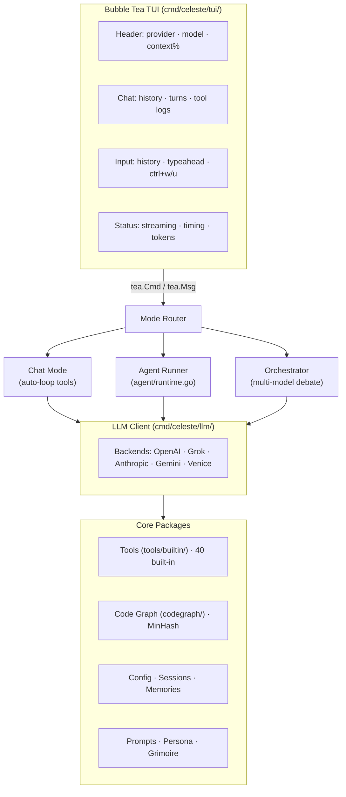

# Kusanagi’s Celeste CLI Architecture: A Demon Noble’s Teasing Tour 😈💕

Comprehensive system architecture for Celeste CLI.

## Table of Contents

- [System Overview](#system-overview)
- [Component Architecture](#component-architecture)
- [Data Flow](#data-flow)
- [Provider System](#provider-system)
- [Tools System](#tools-system)
- [TUI Component](#tui-component)
- [Session Management](#session-management)
- [Configuration System](#configuration-system)

---

## System Overview

Celeste CLI is a terminal-based AI assistant with a Bubble Tea TUI, multi-provider LLM support, persistent sessions, and four distinct runtime modes — each offering a different level of autonomy and observability.

### Key Features

- **Multi-Provider Support**: OpenAI, Grok/xAI, Venice.ai, Anthropic, Gemini, Vertex AI
- **Four Runtime Modes**: Classic chat, Claw (agentic chat), Agent (autonomous runs), Orchestrator (multi-model debate)
- **40 Built-in Tools**: Function calling for weather, currency, QR codes, tarot, and more
- **Interactive TUI**: Split-panel Bubble Tea interface with real-time event streaming
- **Session Persistence**: Auto-save conversations, command history, and model selection across restarts
- **Per-Turn Observability**: Timing and token stats (`3.2s · ↑1.2k ↓483`) visible in all modes
- **NSFW Mode**: Uncensored content generation via Venice.ai
- **Collections / RAG**: Document upload for context injection (xAI only)

### Technology Stack

- **Language**: Go 1.24+
- **TUI Framework**: Bubble Tea + Lip Gloss
- **HTTP Client**: net/http with streaming support
- **Testing**: testify/assert + testify/require
- **Configuration**: JSON-based named config profiles (`~/.celeste/*.json`)

---

## Component Architecture



---

## Runtime Modes

There are four distinct ways to interact with the LLM. They share the same config and provider system but differ fundamentally in where the tool-call loop lives, how much autonomy the model has, and what the TUI shows.

---

### 1. Classic Chat (`-mode classic`, default)

The simplest mode. One request, one response.

```
User types message
  → LLM client streams response chunks (StreamChunkMsg)
  → Response complete (StreamDoneMsg) → token stats captured
  → Simulated typing animation plays out
  → Status bar: "Ready (2.1s · ↑1.2k ↓483)"
```

If the LLM requests a tool call, it is executed and the result is shown inline, but no further LLM call is made automatically. Use claw mode if you want automatic follow-up.

**When to use**: Conversational questions, code review, content generation — anything where a single exchange is sufficient.

---

### 2. Claw Mode (`-mode claw`)

Classic chat extended with an automatic tool-call loop, implemented entirely inside the TUI layer (`tui/app.go`). The agent package is not involved.

```
User types message
  → LLM responds with tool call(s) (SkillCallBatchMsg)
  → TUI executes each tool (SkillResultMsg)
  → TUI resets streamStart, sends results back to LLM ──┐
  → LLM responds again — more tool calls? ──────────────┘
  → Eventually: final text response
  → Status bar: timing + tokens for the final LLM call only
```

A safety cap (`ClawMaxToolIterations`, default 10) stops runaway loops. The loop counter resets with each new user message.

**What it is not**: Claw mode has no planning step, no checkpoints, no workspace awareness, and no multi-turn memory beyond the conversation history. It is a reactive loop, not an autonomous agent.

**Configure**:
```bash
celeste config --set-mode claw               # persist as default
celeste config --set-claw-max-iterations 15  # raise the safety cap
celeste -mode claw chat                      # one-session override
```

**When to use**: Multi-step tasks where you want the model to call tools (search, calculate, look up data) and synthesise the results in a single conversational turn. E.g. "research the latest Rust releases and summarise the breaking changes."

---

### 3. Agent Mode (`/agent <goal>`)

A fully autonomous, multi-turn agent implemented in `cmd/celeste/agent/`. The tool-call loop lives in `agent/runtime.go`, completely separate from the TUI. The TUI receives only event notifications.

```
/agent write a bash script to reorganise these log files
  → agent.Runner.RunGoal() starts in a goroutine
      → planning turn: LLM produces a step-by-step plan
      → execution turns (up to MaxTurns):
          → LLM calls agent tools (bash, read_file, write_file, …)
          → tools run against Workspace (cwd by default)
          → OnProgress callback fires → AgentProgressMsg to TUI
          → OnTurnStats callback fires → turn timing + tokens
      → final response turn
  → TUI shows inline turn separators: ── turn 3/12 ──
  → TUI shows per-turn stats: "Agent: typing response... (3.2s · ↑1.2k ↓483)"
  → Run completes: "Agent complete (45.1s · ↑12.4k ↓3.2k)"
```

Agent runs are checkpointed to disk (`~/.celeste/agent-runs/`). A crashed or interrupted run can be resumed:
```bash
/agent resume <run-id>
/agent list-runs
```

**Key differences from claw mode**:

| | Claw mode | Agent mode |
|---|---|---|
| Loop lives in | TUI (`app.go`) | `agent/runtime.go` |
| Planning step | No | Yes (dedicated planning turn) |
| Checkpoints / resume | No | Yes |
| Workspace awareness | No | Yes (reads/writes files in cwd) |
| Tools available | TUI skills (40 built-ins) | Agent tools (bash, file I/O, …) |
| Memory | Conversation history only | Full run state persisted to disk |
| Observability | Status bar per tool call | Turn separators + per-turn stats in chat |

**When to use**: Long-running autonomous tasks — refactoring a codebase, processing a batch of files, multi-step research with file output.

---

### 4. Orchestrator Mode (`/orchestrate <goal>`)

Wraps the agent runner in a multi-model debate loop. The primary model executes the goal; a separate reviewer model critiques the output; the primary defends; the reviewer issues a verdict. Multiple debate rounds are possible.

```
/orchestrate write a production-ready Go HTTP middleware
  → Classifier determines task lane (code/content/research/…)
  → Primary agent (e.g. grok-4-1-fast) runs RunGoal()
  → Debate round begins:
      → Reviewer (e.g. gpt-4o-mini) critiques output
      → Primary defends
      → Reviewer issues verdict (score 0.0–1.0)
  → If contested: another round (up to MaxRounds)
  → Final output displayed in split panel
```

The split panel TUI shows:
- **Left**: live action feed — classified lane, agent turns, tool calls, debate rounds, review verdicts
- **Right**: file diffs (colour-coded) or review verdict

Both panels are scrollable (`PgUp`/`PgDn`).

**Configure via named config** (e.g. `config.grok.json`):
```json
{
  "orchestrator": {
    "primary_model": "grok-4-1-fast",
    "reviewer_model": "gpt-4o-mini",
    "max_debate_rounds": 3
  }
}
```

**When to use**: Tasks where output quality matters enough to warrant automated review — production code, content with specific requirements, research that needs fact-checking.

---

## Data Flow

### Classic Chat Flow

```
1. User types message → input.go adds to history (↑/↓ to recall)
   ↓
2. Check for slash command (commands/commands.go)
   ├─ /agent  → agent mode (see Runtime Modes)
   ├─ /orchestrate → orchestrator mode
   ├─ /nsfw, /endpoint, /model, etc. → config updates
   └─ plain text → continue to LLM
   ↓
3. streamStart = time.Now()  ← timing starts here
   ↓
4. Build request: system prompt + conversation history + skill definitions
   ↓
5. Send to LLM client (llm/client.go) — streaming
   ↓
6. StreamChunkMsg arrives → append to last assistant message
   ↓
7. StreamDoneMsg arrives → token counts captured (lastMsgInTok/Out)
   ├─ Tool calls requested?
   │   └─ execute tools → streamStart reset →
   │     send results back to LLM → repeat from step 6 (auto-loop, 50 turn cap)
   └─ No tool calls → typing animation with corruption at cursor
   ↓
8. Typing complete → status: "Ready (2.1s · ↑1.2k ↓483)"
   ↓
9. persistSession() → saves messages + command history + endpoint
```

### Agent Mode Flow

```
/agent <goal>
   ↓
1. tui_agent.go: builds agent.Options
   - OnProgress callback → streams AgentProgressMsg to TUI
   - OnTurnStats callback → captures per-turn timing + tokens
   ↓
2. agent.Runner.RunGoal() starts in goroutine
   ↓
3. Planning turn: LLM produces structured plan
   ↓
4. Execution loop (turn 1 … MaxTurns):
   a. TUI receives AgentProgressTurnStart
      → "── turn N/M ──" separator added to chat
      → streamStart reset for this turn
   b. LLM call via SendMessageSync
      → OnTurnStats fires with Elapsed, InputTokens, OutputTokens
   c. Tool calls executed against Workspace (cwd)
      → TUI receives AgentProgressToolCall → "⚙ tool_name" in chat
   d. State checkpointed to ~/.celeste/agent-runs/
   ↓
5. Final response turn:
   → AgentProgressResponse with per-turn stats attached
   → Simulated typing
   → Status: "Agent: typing response... (3.2s · ↑1.2k ↓483)"
   ↓
6. AgentProgressComplete
   → Status: "Agent complete (45.1s · ↑12.4k ↓3.2k)" (run totals)
   → persistSession()
```

### Provider Detection Flow

```
1. Config loaded with base_url (config/config.go)
   ↓
2. DetectProvider(baseURL) called (providers/registry.go)
   ↓
3. URL pattern matching:
   - "api.openai.com" → openai
   - "api.x.ai"       → grok
   - "api.venice.ai"  → venice
   - "generativelanguage.googleapis.com" → gemini
   - "aiplatform.googleapis.com"         → vertex
   ↓
4. Provider capabilities retrieved (SupportsFunctionCalling, etc.)
   ↓
5. Header updated: provider name · model · context window %
```

---

## Provider System

Located in `cmd/celeste/providers/`.

### Design Philosophy

Centralized provider registry with capability-based detection.

### Components

**1. Provider Registry** (`registry.go`):

```go
type ProviderCapabilities struct {
    Name                      string
    BaseURL                   string
    DefaultModel              string
    PreferredToolModel        string
    SupportsFunctionCalling   bool
    SupportsModelListing      bool
    SupportsTokenTracking     bool
    IsOpenAICompatible        bool
    RequiresAPIKey            bool
}

// Registry maps provider names to capabilities
var providerRegistry = map[string]ProviderCapabilities{
    "openai": {
        Name:                    "openai",
        BaseURL:                 "https://api.openai.com/v1",
        DefaultModel:            "gpt-4o-mini",
        PreferredToolModel:      "gpt-4o-mini",
        SupportsFunctionCalling: true,
        SupportsModelListing:    true,
        SupportsTokenTracking:   true,
        IsOpenAICompatible:      true,
        RequiresAPIKey:          true,
    },
    // ... 8 more providers
}
```

**2. Model Detection** (`models.go`):

- Static model lists per provider
- Best tool model recommendations
- Model capability detection (function calling support)

**3. Provider Detection** (`registry.go:DetectProvider()`):

- URL pattern matching
- Fallback to "openai" for unknown URLs
- Case-insensitive detection

### Usage

```go
// Detect provider from URL
provider := providers.DetectProvider("https://api.x.ai/v1")
// Returns: "grok"

// Get capabilities
caps, ok := providers.GetProvider("grok")
if caps.SupportsFunctionCalling {
    // Use with skills
}

// List all tool-capable providers
toolProviders := providers.GetToolCallingProviders()
// Returns: ["openai", "grok", "venice", ...]
```

---

## Tools System

Located in `cmd/celeste/tools/`.

### Design Philosophy

Registry-based tool system with OpenAI function calling format.

### Components

**1. Tool Registry** (`registry.go`):

```go
type Tool struct {
    Name        string
    Description string
    Parameters  map[string]interface{} // JSON schema
}

type Registry struct {
    tools    map[string]Tool
    handlers map[string]tools.Tool.Execute()
}
```

**2. Built-in Tools** (`builtin/`):

23 tools across categories, each in its own file under `tools/builtin/`:
- **Utilities**: UUID, password generation, base64, hashing
- **APIs**: Weather, currency, Twitch, YouTube
- **Media**: QR codes, image generation
- **Personal**: Notes, reminders
- **Mystical**: Tarot reading

**3. Tool Executor** (`executor.go`):

- Parses OpenAI tool calls
- Executes handlers with arguments
- Formats results for LLM

### Related Packages

- **`permissions/`**: Multi-layer allow/deny/ask rules with pattern matching and persistent config
- **`context/`**: Token budget tracking, reactive/proactive compaction, tool result capping
- **`tools/mcp/`**: Model Context Protocol client with stdio/SSE transports for external tool servers
- **`server/`**: Celeste's own MCP server. Exposes persona tools (`celeste`, `celeste_content`,
  `celeste_status`) that route through a chat LLM, plus **direct codegraph tools** added in
  v1.9.0 that bypass the LLM entirely — see the section below.

### Direct Codegraph MCP Tools (v1.9.0+)

`server/codegraph_tools.go` registers five MCP tools that serve codegraph queries
directly from a per-workspace cached `*codegraph.Indexer`, with no chat-LLM
round-trip:

| Tool | Purpose |
|---|---|
| `celeste_index` | `status` / `update` / `rebuild` operations on the workspace index |
| `celeste_code_search` | Semantic search (MinHash Jaccard + BM25 fusion + structural rerank) |
| `celeste_code_review` | Structural code review findings returned as verbatim JSON |
| `celeste_code_graph` | Symbol callers/callees/references |
| `celeste_code_symbols` | List symbols by file or package |

Key design rules:

- **Indexing is explicit.** Query tools never auto-reindex. Callers must invoke
  `celeste_index { operation: "update" }` after code changes.
- **Per-workspace indexer cache.** `Server.indexerFor(workspace)` lazily opens
  the SQLite-backed indexer on first use and caches it; `Server.Close()` walks
  the cache and releases each one on shutdown so WAL files flush cleanly.
- **Progress notifications.** The stdio transport binds a `Notifier` to each
  request context and extracts a client-supplied `progressToken` from
  `params._meta`. Long-running operations (`celeste_index rebuild/update`) call
  `SendProgress(ctx, msg, pct)` to emit `notifications/progress` events that
  stream back to the MCP client in real time.
- **Verbatim results.** Tool output is returned as-is in an MCP `ContentBlock`,
  not summarized by a persona LLM. There's no `max_tokens` ceiling to truncate
  large findings — the only limit is the transport's raw byte buffer.

The legacy persona tools (`celeste`, `celeste_content`, `celeste_status`) are
still registered for "ask Celeste a question" use cases, but tool-driven
workflows should prefer the direct codegraph tools.

### Tool Definition Pattern

```go
func WeatherSkill() Skill {
    return Skill{
        Name:        "get_weather",
        Description: "Get current weather for a location",
        Parameters: map[string]interface{}{
            "type": "object",
            "properties": map[string]interface{}{
                "location": map[string]interface{}{
                    "type":        "string",
                    "description": "City name or zip code",
                },
            },
            "required": []string{"location"},
        },
    }
}

func WeatherHandler(args map[string]interface{}) (interface{}, error) {
    location := args["location"].(string)
    // Make API call
    // Return structured result
}
```

### Tool Definition Format

Tools are converted to OpenAI's function calling format:

```json
{
  "type": "function",
  "function": {
    "name": "get_weather",
    "description": "Get current weather for a location",
    "parameters": {
      "type": "object",
      "properties": {
        "location": {
          "type": "string",
          "description": "City name or zip code"
        }
      },
      "required": ["location"]
    }
  }
}
```

---

## TUI Component

Located in `cmd/celeste/tui/`.

### Layout

```
┌─ Header ──────────────────────────────────────────────────────┐
│  celeste  │  grok  │  grok-4-1-fast  │  🟢 5.2K/128K (4.1%) │
├─ Chat area (scrollable) ──────────────────────────────────────┤
│  [user] hello                                                 │
│  ── turn 1/12 ──                         ← agent separator   │
│  ⚙  read_file("main.go")                ← tool call log      │
│  [assistant] Here's what I found...                          │
├─ Status bar ──────────────────────────────────────────────────┤
│  Ready (2.1s · ↑1.2k ↓483)              ← per-response stats │
├─ Input ───────────────────────────────────────────────────────┤
│  ❯ _                                                          │
└───────────────────────────────────────────────────────────────┘
```

During `/orchestrate` the chat area is replaced by a split panel:

```
┌─ Header ─────────────────────────────────────────────────────┐
├─ AGENT ACTIONS ──────────────┬─ FILE DIFF / VERDICT ─────────┤
│  ● [grok-4-1-fast] turn 1/12 │  src/main.go                  │
│  ● ⚙ read_file               │  @@ -12,6 +12,8 @@            │
│  ● [gpt-4o-mini] reviewing   │  + func newHandler() {        │
│  ↑ 3 older  ↓ pgdn to resume │    line 8-24 / 47             │
├─ Status ─────────────────────┴───────────────────────────────┤
│  Orchestrator: turn 4/12 · ↑12.4k ↓3.2k total               │
└──────────────────────────────────────────────────────────────┘
```

### Key Files

| File | Responsibility |
|------|---------------|
| `app.go` | Root model, Update/View, all message handlers |
| `input.go` | Text input with ↑/↓ command history, ctrl+w/u |
| `chat.go` | Message history, viewport scrolling |
| `split_panel.go` | Two-column action feed + diff panel (orchestrator) |
| `messages.go` | All tea.Msg types: StreamChunkMsg, AgentProgressMsg, OrchestratorEventMsg, … |
| `context.go` | Context window tracker, colour-coded % indicator |
| `styles.go` | Lip Gloss style definitions |

### Message Types and their Handlers

| Message | Source | What it does |
|---------|--------|-------------|
| `StreamChunkMsg` | LLM stream | Appends delta to last assistant message |
| `StreamDoneMsg` | LLM stream end | Captures token counts, starts typing animation |
| `SkillCallBatchMsg` | LLM tool request | Executes skills; in claw mode schedules follow-up |
| `SkillResultMsg` | Skill executor | Appends tool result; if last in batch, sends to LLM |
| `AgentProgressMsg` | agent.Runner | Turn separators, tool logs, per-turn stats, complete summary |
| `OrchestratorEventMsg` | orchestrator | Action feed entries, file diffs, debate rounds, verdicts |
| `TickMsg` | timer | Typing animation; on completion writes `(Xs · ↑Nk ↓Nk)` to status |

### Input Features

- **History navigation**: ↑/↓ arrows cycle through past commands; unsent input is buffered and restored when you navigate back to the end
- **Word delete**: `ctrl+w` deletes the last word; `ctrl+u` clears the line
- **File expansion**: `@filename` in any prompt is replaced with the file's contents before sending
- **Persistence**: Command history is saved to the session JSON and restored on restart

### Observability

Every mode surfaces timing and token information consistently:

- **Regular chat / claw**: status bar shows `(Xs · ↑Nk ↓Nk)` after each response
- **Agent mode**: inline `── turn N/M ──` separators; per-turn stats on each response; run total on completion
- **Orchestrator**: per-action stats in the split panel action feed; running total in the status bar
- **Context usage**: colour-coded header indicator — 🟢 OK / 🟡 75% / 🟠 85% / 🔴 95%

---

## Session Management

Located in `cmd/celeste/config/`.

### Session Structure

Sessions persist the full conversation state across restarts — including command history, so `↑` in the input box recalls commands from previous sessions.

```go
type Session struct {
    ID           string
    Name         string          // auto-generated from first user message
    CreatedAt    time.Time
    UpdatedAt    time.Time
    Messages     []SessionMessage
    Provider     string
    Model        string
    NSFWMode     bool
    TokenCount   int
    UsageMetrics UsageMetrics    // prompt + completion token totals
    Metadata     map[string]any  // command_history stored here
}
```

### Storage Format

```
~/.celeste/
├── config.json              ← default config profile
├── config.grok.json         ← named profile (loaded with /endpoint grok)
├── config.openai.json       ← named profile
├── sessions/
│   ├── session_<id>.json    ← one file per session, auto-resumed on start
│   └── ...
└── agent-runs/
    └── <run-id>/            ← agent checkpoint files (resumable)
```

### Session Operations

**1. Create Session** (`session.go:NewSession()`):
- Generate unique ID
- Set creation timestamp
- Initialize empty message history

**2. Save Session** (`session.go:Save()`):
- Marshal to JSON
- Write to `~/.celeste/sessions/session_{ID}.json`

**3. Load Session** (`session.go:Load()`):
- Read JSON file
- Unmarshal to Session struct
- Restore message history

**4. Export/Import** (`export.go`):
- Export sessions to custom location
- Import from external files
- Batch export/import

---

## Configuration System

Located in `cmd/celeste/config/`.

### Config Structure

```go
type Config struct {
    BaseURL         string
    Model           string
    APIKey          string
    ContextWindow   int
    SystemPrompt    string
    NSFWMode        bool
    SkipPrompt      bool
    SessionID       string
    Temperature     float64
    TopP            float64
}
```

### Config File

Location: `~/.celeste/config.json`

```json
{
  "base_url": "https://api.openai.com/v1",
  "model": "gpt-4o-mini",
  "api_key": "sk-...",
  "context_window": 128000,
  "system_prompt": "",
  "nsfw_mode": false,
  "skip_prompt": false,
  "temperature": 0.7,
  "top_p": 1.0
}
```

### Config Loading Priority

1. Command-line flags
2. Environment variables (`OPENAI_API_KEY`, etc.)
3. Config file (`~/.celeste/config.json`)
4. Default values

### Provider-Specific Configs

Some features require provider-specific config:

```
~/.celeste/
├── config.json          # Main config
├── venice_config.json   # Venice.ai API key + media settings
├── weather_config.json  # Weather API key
├── twitch_config.json   # Twitch credentials
└── youtube_config.json  # YouTube API key
```

---

## Key Design Patterns

### 1. Registry Pattern

Used for:
- Provider registry (providers/)
- Tool registry (tools/builtin/)

Benefits:
- Centralized registration
- Easy extension
- Capability-based querying

### 2. Strategy Pattern

Used for:
- Provider selection (different APIs, same interface)
- Model selection (best for task)

### 3. Observer Pattern

Used for:
- Streaming responses (TUI observes LLM chunks)
- State updates (Bubble Tea message loop)

### 4. Command Pattern

Used for:
- Slash commands (/help, /providers, /clear)
- Skill execution

---

## Extension Points

### Adding a New Provider

1. Add to `providers/registry.go`:

```go
"newprovider": {
    Name:                    "newprovider",
    BaseURL:                 "https://api.newprovider.com/v1",
    DefaultModel:            "model-name",
    SupportsFunctionCalling: true,
    IsOpenAICompatible:      true,
    RequiresAPIKey:          true,
},
```

2. Add URL detection in `DetectProvider()`
3. Add model list in `models.go`
4. Test with integration tests

### Adding a New Skill

1. Define skill in `tools/builtin/*.go`:

```go
func NewSkill() Skill {
    return Skill{
        Name:        "new_skill",
        Description: "Description",
        Parameters:  /* JSON schema */,
    }
}
```

2. Implement handler:

```go
func NewSkillHandler(args map[string]interface{}) (interface{}, error) {
    // Implementation
}
```

3. Register in `RegisterBuiltinSkills()`:

```go
registry.RegisterSkill(NewSkill())
registry.RegisterHandler("new_skill", NewSkillHandler)
```

### Adding a New Command

1. Add to `commands/commands.go`:

```go
case "newcmd":
    return handleNewCommand(cmd, ctx)
```

2. Implement handler:

```go
func handleNewCommand(cmd *Command, ctx *CommandContext) *CommandResult {
    // Implementation
}
```

3. Add tests in `commands_test.go`

---

## Performance Considerations

### Streaming

- All LLM responses use streaming
- Reduces perceived latency
- Better UX for long responses

### Context Management

- Automatic summarization when context window fills
- Keeps recent messages, summarizes old ones
- Configurable context window per provider

### Caching

- Session files cached in memory during chat
- Config loaded once at startup
- Provider capabilities cached in registry

---

## Security Considerations

### API Key Storage

- Stored in `~/.celeste/config.json` (permissions: 0600)
- Never logged or displayed
- Can use environment variables instead

### Skill Execution

- Skills run in same process (no sandboxing)
- Trust model: user-controlled skills directory
- Validate skill inputs before execution

### Network Requests

- All HTTPS by default
- Streaming over persistent connections
- Timeout configurations

---

## Testing Strategy

### Unit Tests

- **Providers**: Registry, model detection, capabilities
- **Tools**: Registration, tool definitions, parameter schemas
- **Commands**: Parsing, execution, state changes
- **Prompts**: Persona loading, system prompt generation
- **Venice**: Media parsing, file handling

### Integration Tests

- **Provider APIs**: Real API calls (gated by API keys)
- **Tools**: With mocked external dependencies
- **End-to-end**: Full chat flow (requires HTTP mocking)

### Test Coverage

- Target: 20%+ (achieved: 17.4%)
- Critical packages: >70% (prompts, providers)
- Feature packages: >20% (commands, skills, venice)
- Infrastructure: Requires mocking (llm, tui)

---

## Further Reading

- [Provider Documentation](./LLM_PROVIDERS.md)
- [Testing Guide](./TESTING.md)
- [Contributing Guide](./CONTRIBUTING.md)
- [Claw Mode Build Plan](./plans/2026-03-01-celeste-claw-feature-buildout.md)
- [Agent Mode Build Plan](./plans/2026-03-02-autonomous-agent-mode-buildout.md)
- [Orchestrator Design](./superpowers/specs/2026-03-15-orchestrator-design.md)
- [Bubble Tea Docs](https://github.com/charmbracelet/bubbletea)

---

**Last Updated**: 2026-04-03
**Version**: v1.9.1\n\nBuilt with [Celeste CLI](https://github.com/whykusanagi/celeste-cli)
