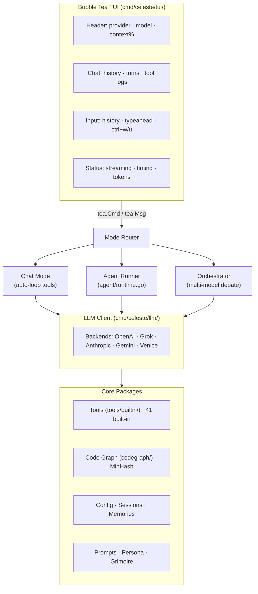

# Kusanagi’s Celeste CLI Architecture: A Demon Noble’s Teasing Tour 😈💕

Comprehensive system architecture for Celeste CLI.

## Table of Contents

- [System Overview](#system-overview)
- [Component Architecture](#component-architecture)
- [Data Flow](#data-flow)
- [Provider System](#provider-system)
- [Tools System](#tools-system)
- [TUI Component](#tui-component)
- [Session Management](#session-management)
- [Configuration System](#configuration-system)

---

## System Overview

Celeste CLI is a terminal-based AI assistant with a Bubble Tea TUI, multi-provider LLM support, persistent sessions, and three ways to run: chat, agent and orchestrator — each offering a different level of autonomy and observability.

### Key Features

- **Multi-Provider Support**: OpenAI, Grok/xAI, Venice.ai, Anthropic, Gemini, Vertex AI
- **Three Ways to Run**: Chat (tools always loop), Agent (autonomous runs), Orchestrator (multi-model debate)
- **48 Built-in Tools**: Function calling for weather, currency, QR codes, tarot, and more
- **Interactive TUI**: Split-panel Bubble Tea interface with real-time event streaming
- **Session Persistence**: Auto-save conversations, command history, and model selection across restarts
- **Per-Turn Observability**: Timing and token stats (`3.2s · ↑1.2k ↓483`) visible in all modes
- **NSFW Mode**: Uncensored content generation via Venice.ai
- **Collections / RAG**: Document upload for context injection (xAI only)

### Technology Stack

- **Language**: Go 1.24+
- **TUI Framework**: Bubble Tea + Lip Gloss
- **HTTP Client**: net/http with streaming support
- **Testing**: testify/assert + testify/require
- **Configuration**: JSON-based named config profiles (`~/.celeste/*.json`)

---

## Component Architecture


```mermaid
flowchart TD
    subgraph TUI["Bubble Tea TUI (cmd/celeste/tui/)"]
        Header["Header: provider · model · context%"]
        Chat["Chat: history · turns · tool logs"]
        Input["Input: history · typeahead · ctrl+w/u"]
        Status["Status: streaming · timing · tokens"]
    end

    TUI -->|"tea.Cmd / tea.Msg"| Router["Mode Router"]

    Router --> ChatMode["Chat Mode\n(auto-loop tools)"]
    Router --> Agent["Agent Runner\n(agent/runtime.go)"]
    Router --> Orch["Orchestrator\n(multi-model debate)"]

    ChatMode --> LLM
    Agent --> LLM
    Orch --> LLM

    subgraph LLM["LLM Client (cmd/celeste/llm/)"]
        Backends["Backends: OpenAI · Grok · Anthropic · Gemini · Venice"]
    end

    LLM --> Tools

    subgraph Tools["Core Packages"]
        ToolReg["Tools (tools/builtin/) · 41 built-in"]
        CodeGraph["Code Graph (codegraph/) · MinHash"]
        Config["Config · Sessions · Memories"]
        Prompts["Prompts · Persona · Grimoire"]
    end
```

---

## Three Ways to Run

There are three distinct ways to interact with the LLM. They share the same config and provider system but differ fundamentally in how much autonomy the model has and what the TUI shows.

---

### 1. Chat (default)

Chat's tool calls run on `loop.Loop` (`cmd/celeste/loop`), the same loop
agent runs and MCP chat use. The TUI renders its events; it never executes
a tool itself. There is no separate "no tools" mode — 1.x's `classic` and
`claw` runtime modes were the same program with a cosmetic flag, so 2.0
dropped the flag (#144); every chat turn loops until the model answers
without tools or the turn cap stops it.

**Steering (2.0 W3).** `Loop.Steering` sees every event before consumers
do. A text delta can cut the request short (`ErrRuleInterrupt`, never
retried by the client); a turn's complete tool calls are checked before
they are recorded or run. The loop drops the interrupted reply
(`EventRuleInterrupt`) and re-runs the turn with the reminder as a hidden
`<system-reminder>` message (`EventRule`), at most twice per turn.
`steer.Session` implements it for a chat, an agent run or an MCP call,
with the stream rules `loop.Setup` loads into `Env.Rules`.

```
User types message
  → AppModel.startTurn → TUIClientAdapter.RunTurn (one loop.Loop run, own goroutine)
  → loop: UserPromptSubmit → prune → request → tool calls (parallel when safe)
  → loop events → mailbox → TurnEventMsg chain → AppModel renders
  → Enter during the turn: Loop.Steer (joins at the next tool step)
  → Esc: cancels the run's context
  → TurnDoneMsg: guards, caps, leftover steers
```

The turn cap is `max_tool_iterations` (default 25). The identical-call
(3) and progress (6) guards stop runaway loops.

Every run the chat starts — a turn, an `/agent` goal, an `/orchestrate`
run — tags its context with a `tui.RunOwner`. `loop.PromptGate` passes the
asking call's context on the `tools.PermissionRequest`, and the chat's prompt
bridges (`chat_prompts.go`) copy the owner and the run's `Done` into the
modal message, so `AppModel` answers a request from a run that has ended
instead of showing it. Subagents and `/agent` nest under the chat's
`loop.Env` (`Env.Nested`), sharing its hooks, code graph and global MCP
servers. A nested run's copy of an MCP tool finds its server's client by
name through `mcp.Manager` at call time, so it follows a `/mcp` reconnect.

**What it is not**: Chat has no planning step, no checkpoints, no workspace awareness, and no multi-turn memory beyond the conversation history. It is a reactive loop, not an autonomous agent.

**Configure**:
```bash
celeste config --set-max-tool-iterations 15  # raise the safety cap
```

**When to use**: Anything from a single conversational exchange to a multi-step task where you want the model to call tools (search, calculate, look up data) and synthesise the results. E.g. "research the latest Rust releases and summarise the breaking changes."

---

### 2. Agent Mode (`/agent <goal>`)

A fully autonomous, multi-turn agent implemented in `cmd/celeste/agent/`. The tool-call loop lives in `agent/runtime.go`, completely separate from the TUI. The TUI receives only event notifications.

```
/agent write a bash script to reorganise these log files
  → agent.Runner.RunGoal() starts in a goroutine
      → planning turn: LLM produces a step-by-step plan
      → execution turns (up to MaxTurns):
          → LLM calls agent tools (bash, read_file, write_file, …)
          → tools run against Workspace (cwd by default)
          → OnProgress callback fires → AgentProgressMsg to TUI
          → OnTurnStats callback fires → turn timing + tokens
      → final response turn
  → TUI shows inline turn separators: ── turn 3/12 ──
  → TUI shows per-turn stats: "Agent: typing response... (3.2s · ↑1.2k ↓483)"
  → Run completes: "Agent complete (45.1s · ↑12.4k ↓3.2k)"
```

Agent runs are checkpointed to disk (`~/.celeste/agent-runs/`). A crashed or interrupted run can be resumed:
```bash
/agent resume <run-id>
/agent list-runs
```

**Key differences from chat**:

| | Chat | Agent mode |
|---|---|---|
| Loop lives in | TUI (`app.go`) | `agent/runtime.go` |
| Planning step | No | Yes (dedicated planning turn) |
| Checkpoints / resume | No | Yes |
| Workspace awareness | No | Yes (reads/writes files in cwd) |
| Tools available | TUI skills (41 built-ins) | Agent tools (bash, file I/O, …) |
| Memory | Conversation history only | Full run state persisted to disk |
| Observability | Status bar per tool call | Turn separators + per-turn stats in chat |

**When to use**: Long-running autonomous tasks — refactoring a codebase, processing a batch of files, multi-step research with file output.

---

### 3. Orchestrator Mode (`/orchestrate <goal>`)

Wraps the agent runner in a multi-model debate loop. The primary model executes the goal; a separate reviewer model critiques the output; the primary defends; the reviewer issues a verdict. Multiple debate rounds are possible.

```
/orchestrate write a production-ready Go HTTP middleware
  → Classifier determines task lane (code/content/research/…)
  → Primary agent (e.g. grok-4-1-fast) runs RunGoal()
  → Debate round begins:
      → Reviewer (e.g. gpt-4o-mini) critiques output
      → Primary defends
      → Reviewer issues verdict (score 0.0–1.0)
  → If contested: another round (up to MaxRounds)
  → Final output displayed in split panel
```

The split panel TUI shows:
- **Left**: live action feed — classified lane, agent turns, tool calls, debate rounds, review verdicts
- **Right**: file diffs (colour-coded) or review verdict

Both panels are scrollable (`PgUp`/`PgDn`).

**Configure via named config** (e.g. `config.grok.json`):
```json
{
  "orchestrator": {
    "primary_model": "grok-4-1-fast",
    "reviewer_model": "gpt-4o-mini",
    "max_debate_rounds": 3
  }
}
```

**When to use**: Tasks where output quality matters enough to warrant automated review — production code, content with specific requirements, research that needs fact-checking.

---

## Data Flow

### Chat Flow

```
1. User types message → input.go adds to history (↑/↓ to recall)
   ↓
2. Check for slash command (commands/commands.go)
   ├─ /agent  → agent mode (see Three Ways to Run)
   ├─ /orchestrate → orchestrator mode
   ├─ /nsfw, /endpoint, /model, etc. → config updates
   └─ plain text → continue to LLM
   ↓
3. streamStart = time.Now()  ← timing starts here
   ↓
4. startTurn → TUIClientAdapter.RunTurn: one loop.Loop run on its own
   goroutine (system prompt + conversation history + skill definitions)
   ↓
5. The loop streams the request (llm/client.go); its events reach the TUI
   as a TurnEventMsg chain
   ↓
6. StreamChunkMsg arrives → append to last assistant message
   ↓
7. The reply is complete
   ├─ Tool calls requested?
   │   └─ the loop runs the tools (ToolStartMsg/ToolResultMsg) →
   │     streamStart reset → next request → repeat from step 6
   │     (turn cap max_tool_iterations, default 25)
   └─ No tool calls → StreamDoneMsg: token counts captured
      (lastMsgInTok/Out), typing animation with corruption at cursor
   ↓
8. Typing complete → status: "Ready (2.1s · ↑1.2k ↓483)"
   ↓
9. persistSession() → saves messages + command history + endpoint
```

### Agent Mode Flow

```
/agent <goal>
   ↓
1. tui_agent.go: builds agent.Options
   - OnProgress callback → streams AgentProgressMsg to TUI
   - OnTurnStats callback → captures per-turn timing + tokens
   ↓
2. agent.Runner.RunGoal() starts in goroutine
   ↓
3. Planning turn: LLM produces structured plan
   ↓
4. Execution loop (turn 1 … MaxTurns):
   a. TUI receives AgentProgressTurnStart
      → "── turn N/M ──" separator added to chat
      → streamStart reset for this turn
   b. LLM call via SendMessageSync
      → OnTurnStats fires with Elapsed, InputTokens, OutputTokens
   c. Tool calls executed against Workspace (cwd)
      → TUI receives AgentProgressToolCall → "⚙ tool_name" in chat
   d. State checkpointed to ~/.celeste/agent-runs/
   ↓
5. Final response turn:
   → AgentProgressResponse with per-turn stats attached
   → Simulated typing
   → Status: "Agent: typing response... (3.2s · ↑1.2k ↓483)"
   ↓
6. AgentProgressComplete
   → Status: "Agent complete (45.1s · ↑12.4k ↓3.2k)" (run totals)
   → persistSession()
```

### Provider Detection Flow

```
1. Config loaded with base_url (config/config.go)
   ↓
2. DetectProvider(baseURL) called (providers/registry.go)
   ↓
3. URL pattern matching:
   - "api.openai.com" → openai
   - "api.x.ai"       → grok
   - "api.venice.ai"  → venice
   - "generativelanguage.googleapis.com" → gemini
   - "aiplatform.googleapis.com"         → vertex
   ↓
4. Provider capabilities retrieved (SupportsFunctionCalling, etc.)
   ↓
5. Header updated: provider name · model · context window %
```

---

## Provider System

Located in `cmd/celeste/providers/`.

### Design Philosophy

Centralized provider registry with capability-based detection.

### Components

**1. Provider Registry** (`registry.go`):

```go
type ProviderCapabilities struct {
    Name                      string
    BaseURL                   string
    DefaultModel              string
    PreferredToolModel        string
    SupportsFunctionCalling   bool
    SupportsModelListing      bool
    SupportsTokenTracking     bool
    IsOpenAICompatible        bool
    RequiresAPIKey            bool
}

// Registry maps provider names to capabilities
var providerRegistry = map[string]ProviderCapabilities{
    "openai": {
        Name:                    "openai",
        BaseURL:                 "https://api.openai.com/v1",
        DefaultModel:            "gpt-4o-mini",
        PreferredToolModel:      "gpt-4o-mini",
        SupportsFunctionCalling: true,
        SupportsModelListing:    true,
        SupportsTokenTracking:   true,
        IsOpenAICompatible:      true,
        RequiresAPIKey:          true,
    },
    // ... 8 more providers
}
```

**2. Model Detection** (`models.go`):

- Static model lists per provider
- Best tool model recommendations
- Model capability detection (function calling support)

**3. Provider Detection** (`registry.go:DetectProvider()`):

- URL pattern matching
- Fallback to "openai" for unknown URLs
- Case-insensitive detection

### Usage

```go
// Detect provider from URL
provider := providers.DetectProvider("https://api.x.ai/v1")
// Returns: "grok"

// Get capabilities
caps, ok := providers.GetProvider("grok")
if caps.SupportsFunctionCalling {
    // Use with skills
}

// List all tool-capable providers
toolProviders := providers.GetToolCallingProviders()
// Returns: ["openai", "grok", "venice", ...]
```

---

## Tools System

Located in `cmd/celeste/tools/`.

### Design Philosophy

Registry-based tool system with OpenAI function calling format.

### Components

**1. Tool Registry** (`registry.go`):

```go
type Tool struct {
    Name        string
    Description string
    Parameters  map[string]interface{} // JSON schema
}

type Registry struct {
    tools    map[string]Tool
    handlers map[string]tools.Tool.Execute()
}
```

**2. Built-in Tools** (`builtin/`):

48 tools across categories, each in its own file under `tools/builtin/`:
- **Utilities**: UUID, password generation, base64, hashing
- **APIs**: Weather, currency, Twitch, YouTube
- **Media**: QR codes, image generation
- **Personal**: Notes, reminders
- **Mystical**: Tarot reading

**3. Tool Executor** (`executor.go`):

- Parses OpenAI tool calls
- Executes handlers with arguments
- Formats results for LLM

### Related Packages

- **`permissions/`**: Multi-layer allow/deny/ask rules with pattern matching and persistent config
- **`context/`**: Token budget tracking, reactive/proactive compaction, tool result capping
- **`tools/mcp/`**: Model Context Protocol client with stdio/SSE transports for external tool servers
- **`server/`**: Celeste's own MCP server. Exposes persona tools (`celeste`, `celeste_content`,
  `celeste_status`) that route through a chat LLM, plus **direct codegraph tools** added in
  v1.9.0 that bypass the LLM entirely — see the section below.

### Direct Codegraph MCP Tools (v1.9.0+)

`server/codegraph_tools.go` registers five MCP tools that serve codegraph queries
directly from a per-workspace cached `*codegraph.Indexer`, with no chat-LLM
round-trip:

| Tool | Purpose |
|---|---|
| `celeste_index` | `status` / `update` / `rebuild` operations on the workspace index |
| `celeste_code_search` | Semantic search (MinHash Jaccard + BM25 fusion + structural rerank) |
| `celeste_code_review` | Structural code review findings returned as verbatim JSON |
| `celeste_code_graph` | Symbol callers/callees/references |
| `celeste_code_symbols` | List symbols by file or package |

Key design rules:

- **Indexing is explicit.** Query tools never auto-reindex. Callers must invoke
  `celeste_index { operation: "update" }` after code changes.
- **Per-workspace indexer cache.** `Server.indexerFor(workspace)` lazily opens
  the SQLite-backed indexer on first use and caches it; `Server.Close()` walks
  the cache and releases each one on shutdown so WAL files flush cleanly.
- **Progress notifications.** The stdio transport binds a `Notifier` to each
  request context and extracts a client-supplied `progressToken` from
  `params._meta`. Long-running operations (`celeste_index rebuild/update`) call
  `SendProgress(ctx, msg, pct)` to emit `notifications/progress` events that
  stream back to the MCP client in real time.
- **Verbatim results.** Tool output is returned as-is in an MCP `ContentBlock`,
  not summarized by a persona LLM. There's no `max_tokens` ceiling to truncate
  large findings — the only limit is the transport's raw byte buffer.

The legacy persona tools (`celeste`, `celeste_content`, `celeste_status`) are
still registered for "ask Celeste a question" use cases, but tool-driven
workflows should prefer the direct codegraph tools.

#### `celeste_status` and the `commit` field

`celeste_status` reports a **`commit`** field carrying the git commit the running
binary was built from. An MCP server is long-lived, so a client can keep talking
to a server you started days and several merges ago while `celeste version`
prints a string identical to the current one. One server here ran twelve hours on
a binary five merges behind and reported the same version as the new build. When
a fix seems not to have landed, compare `commit` against
`git rev-parse --short HEAD` before you debug anything else.

The neighbouring `health` field means the process is up. It does not exercise the
model, so it tells you nothing about whether generation works.

### Tool Definition Pattern

```go
func WeatherSkill() Skill {
    return Skill{
        Name:        "get_weather",
        Description: "Get current weather for a location",
        Parameters: map[string]interface{}{
            "type": "object",
            "properties": map[string]interface{}{
                "location": map[string]interface{}{
                    "type":        "string",
                    "description": "City name or zip code",
                },
            },
            "required": []string{"location"},
        },
    }
}

func WeatherHandler(args map[string]interface{}) (interface{}, error) {
    location := args["location"].(string)
    // Make API call
    // Return structured result
}
```

### Tool Definition Format

Tools are converted to OpenAI's function calling format:

```json
{
  "type": "function",
  "function": {
    "name": "get_weather",
    "description": "Get current weather for a location",
    "parameters": {
      "type": "object",
      "properties": {
        "location": {
          "type": "string",
          "description": "City name or zip code"
        }
      },
      "required": ["location"]
    }
  }
}
```

---

## TUI Component

Located in `cmd/celeste/tui/`.

### Layout

```
┌─ Header ──────────────────────────────────────────────────────┐
│  celeste  │  grok  │  grok-4-1-fast  │  🟢 5.2K/128K (4.1%) │
├─ Chat area (scrollable) ──────────────────────────────────────┤
│  [user] hello                                                 │
│  ── turn 1/12 ──                         ← agent separator   │
│  ⚙  read_file("main.go")                ← tool call log      │
│  [assistant] Here's what I found...                          │
├─ Status bar ──────────────────────────────────────────────────┤
│  Ready (2.1s · ↑1.2k ↓483)              ← per-response stats │
├─ Input ───────────────────────────────────────────────────────┤
│  ❯ _                                                          │
└───────────────────────────────────────────────────────────────┘
```

During `/orchestrate` the chat area is replaced by a split panel:

```
┌─ Header ─────────────────────────────────────────────────────┐
├─ AGENT ACTIONS ──────────────┬─ FILE DIFF / VERDICT ─────────┤
│  ● [grok-4-1-fast] turn 1/12 │  src/main.go                  │
│  ● ⚙ read_file               │  @@ -12,6 +12,8 @@            │
│  ● [gpt-4o-mini] reviewing   │  + func newHandler() {        │
│  ↑ 3 older  ↓ pgdn to resume │    line 8-24 / 47             │
├─ Status ─────────────────────┴───────────────────────────────┤
│  Orchestrator: turn 4/12 · ↑12.4k ↓3.2k total               │
└──────────────────────────────────────────────────────────────┘
```

### Key Files

| File | Responsibility |
|------|---------------|
| `app.go` | Root model, Update/View, all message handlers |
| `input.go` | Text input with ↑/↓ command history, ctrl+w/u |
| `chat.go` | Message history, viewport scrolling |
| `split_panel.go` | Two-column action feed + diff panel (orchestrator) |
| `messages.go` | All tea.Msg types: StreamChunkMsg, AgentProgressMsg, OrchestratorEventMsg, … |
| `context.go` | Context window tracker, colour-coded % indicator |
| `styles.go` | Lip Gloss style definitions |

### Message Types and their Handlers

| Message | Source | What it does |
|---------|--------|-------------|
| `StreamChunkMsg` | loop text delta | Appends delta to last assistant message |
| `StreamDoneMsg` | loop reply without tools | Captures token counts, starts typing animation |
| `TurnEventMsg` | chat turn (loop events) | Wraps one event of the running turn; its `Next` reads the one after |
| `HistoryMsg` | loop snapshot | Syncs the chat's history to the loop's, position by position |
| `ToolStartMsg` / `ToolResultMsg` | loop tool calls | Tool cards, skill log, NSFW toggle |
| `TurnDoneMsg` | end of a turn | Guard or cap notice, leftover steers, automatic summary |
| `AgentProgressMsg` | agent.Runner | Turn separators, tool logs, per-turn stats, complete summary |
| `OrchestratorEventMsg` | orchestrator | Action feed entries, file diffs, debate rounds, verdicts |
| `TickMsg` | timer | Typing animation; on completion writes `(Xs · ↑Nk ↓Nk)` to status |

### Input Features

- **History navigation**: ↑/↓ arrows cycle through past commands; unsent input is buffered and restored when you navigate back to the end
- **Word delete**: `ctrl+w` deletes the last word; `ctrl+u` clears the line
- **File expansion**: `@filename` in any prompt is replaced with the file's contents before sending
- **Persistence**: Command history is saved to the session JSON and restored on restart

### Observability

Every mode surfaces timing and token information consistently:

- **Chat**: status bar shows `(Xs · ↑Nk ↓Nk)` after each response
- **Agent mode**: inline `── turn N/M ──` separators; per-turn stats on each response; run total on completion
- **Orchestrator**: per-action stats in the split panel action feed; running total in the status bar
- **Context usage**: colour-coded header indicator — 🟢 OK / 🟡 75% / 🟠 85% / 🔴 95%

---

## Session Management

Located in `cmd/celeste/config/`.

### Session Structure

Sessions persist the full conversation state across restarts — including command history, so `↑` in the input box recalls commands from previous sessions.

```go
type Session struct {
    ID           string
    Name         string          // auto-generated from first user message
    CreatedAt    time.Time
    UpdatedAt    time.Time
    Messages     []SessionMessage
    Provider     string
    Model        string
    NSFWMode     bool
    TokenCount   int
    UsageMetrics UsageMetrics    // prompt + completion token totals
    Metadata     map[string]any  // command_history stored here
}
```

### Message model (2.0)

Every message (`tui.ChatMessage`, saved as `config.SessionMessage`) has a provider-neutral view (`Content`, `ToolCalls`) that every provider, the UI and compaction use. It can also carry `ProviderBlocks`: the reply exactly as one provider returned it (thinking blocks with signatures, reasoning items, compaction blocks), saved as `provider_blocks`.

- **Precedence.** The backend that produced the blocks (same format, endpoint and model, `llm.ProviderKey`) sends them instead of rebuilding the message from `Content` and `ToolCalls`. Any other backend ignores them and sends the neutral view.
- **Edits.** Blocks are sealed to the neutral view they arrived with (`digest`). Pruning, a summary cut or a dropped tool call clears them; any other change makes them inert. When a provider rejects replayed blocks, the backend reports it (`BlocksRejected`) and whoever sent the request (the loop, or the agent's planning request) strips blocks from the whole history; the chat and the saved session take the stripped history even when the run ends right after.
- **Append-only history.** A tool result is capped once, at 128 KiB, when it is recorded. Nothing trims or rewrites the history per request, so a message reaches the provider with the same bytes on every later turn. Compaction is the only rewriter.

```go
type ProviderBlocks struct {
    Provider string            // llm.ProviderKey: format|endpoint|model
    Digest   string            // tui.BlocksDigest(Content, ToolCalls) when attached
    Blocks   []json.RawMessage // canonical JSON, in the provider's order
}
```

### File checkpoints (2.0)

`checkpoints.SnapshotManager` is one session's store: backups plus `index.json`, a JSON array of `{message_id, path, version, backup, time}` in `~/.celeste/checkpoints/<session>/`, rewritten atomically on every change under a per-session lock file. `loop.Setup` opens it for the run's `SessionID` (chat session, agent run, the MCP chat Env; `<mode>-<pid>-<start nanos>` when none is given); nested Envs (subagents, `/agent`) share their parent's.

- **Timing.** `write_file`, `patch_file` and `splice_file` call `Checkpoint(path, callID)` after their input validated, immediately before writing; any failure after it calls `Rollback`, which restores the file and drops the entry. `message_id` is the tool call's ID (`tools.CallIDFromContext`, set by the loop's `runGroup` for every call).
- **Consumers.** `/undo` (`RevertLast`, through `tui.Checkpointer`; it asks before overwriting a file modified after the change, `ModifiedAfter`), `/diff` (`ComputeDiff` + `FormatChanges`), `celeste revert` (`RevertFile`, latest session by default), `/rewind` (`RewindTo`, W4), the files-modified list for compaction (`Files`, W1/#200).
- **Restore.** Atomic (temporary file, rename), so other hard links, ownership, extended attributes and ACLs are not kept; in place when no temporary file can be created in the file's directory.
- **Limits.** At most 100 entries per session (the oldest is evicted with its backup); no byte limit on a backup.
- **Retention.** The first store a process opens prunes sessions that are neither among the 20 most recently changed nor changed in the last 30 days.

### Storage Format

```
~/.celeste/
├── config.json              ← default config profile
├── config.grok.json         ← named profile (loaded with /endpoint grok)
├── config.openai.json       ← named profile
├── sessions/
│   ├── session_<id>.json    ← one file per session, auto-resumed on start
│   └── ...
├── checkpoints/
│   └── <session>/           ← file backups + index.json (/undo, /diff, celeste revert)
└── agent-runs/
    └── <run-id>/            ← agent checkpoint files (resumable)
```

### Session Operations

**1. Create Session** (`session.go:NewSession()`):
- Generate unique ID
- Set creation timestamp
- Initialize empty message history

**2. Save Session** (`session.go:Save()`):
- Marshal to JSON
- Write to `~/.celeste/sessions/session_{ID}.json`

**3. Load Session** (`session.go:Load()`):
- Read JSON file
- Unmarshal to Session struct
- Restore message history

**4. Export/Import** (`export.go`):
- Export sessions to custom location
- Import from external files
- Batch export/import

---

## Configuration System

Located in `cmd/celeste/config/`.

### Config Structure

```go
type Config struct {
    BaseURL         string
    Model           string
    APIKey          string
    ContextWindow   int
    SystemPrompt    string
    NSFWMode        bool
    SkipPrompt      bool
    SessionID       string
    Temperature     float64
    TopP            float64
}
```

### Config File

Location: `~/.celeste/config.json`

```json
{
  "base_url": "https://api.openai.com/v1",
  "model": "gpt-4o-mini",
  "api_key": "sk-...",
  "context_window": 128000,
  "system_prompt": "",
  "nsfw_mode": false,
  "skip_prompt": false,
  "temperature": 0.7,
  "top_p": 1.0
}
```

### Config Loading Priority

1. Command-line flags
2. Environment variables (`OPENAI_API_KEY`, etc.)
3. Config file (`~/.celeste/config.json`)
4. Default values

### Provider-Specific Configs

Some features require provider-specific config:

```
~/.celeste/
├── config.json          # Main config
├── venice_config.json   # Venice.ai API key + media settings
├── weather_config.json  # Weather API key
├── twitch_config.json   # Twitch credentials
└── youtube_config.json  # YouTube API key
```

---

## Key Design Patterns

### 1. Registry Pattern

Used for:
- Provider registry (providers/)
- Tool registry (tools/builtin/)

Benefits:
- Centralized registration
- Easy extension
- Capability-based querying

### 2. Strategy Pattern

Used for:
- Provider selection (different APIs, same interface)
- Model selection (best for task)

### 3. Observer Pattern

Used for:
- Streaming responses (TUI observes LLM chunks)
- State updates (Bubble Tea message loop)

### 4. Command Pattern

Used for:
- Slash commands (/help, /providers, /clear)
- Skill execution

---

## Extension Points

### Adding a New Provider

1. Add to `providers/registry.go`:

```go
"newprovider": {
    Name:                    "newprovider",
    BaseURL:                 "https://api.newprovider.com/v1",
    DefaultModel:            "model-name",
    SupportsFunctionCalling: true,
    IsOpenAICompatible:      true,
    RequiresAPIKey:          true,
},
```

2. Add URL detection in `DetectProvider()`
3. Add model list in `models.go`
4. Test with integration tests

### Adding a New Skill

1. Define skill in `tools/builtin/*.go`:

```go
func NewSkill() Skill {
    return Skill{
        Name:        "new_skill",
        Description: "Description",
        Parameters:  /* JSON schema */,
    }
}
```

2. Implement handler:

```go
func NewSkillHandler(args map[string]interface{}) (interface{}, error) {
    // Implementation
}
```

3. Register in `RegisterBuiltinSkills()`:

```go
registry.RegisterSkill(NewSkill())
registry.RegisterHandler("new_skill", NewSkillHandler)
```

### Adding a New Command

1. Add to `commands/commands.go`:

```go
case "newcmd":
    return handleNewCommand(cmd, ctx)
```

2. Implement handler:

```go
func handleNewCommand(cmd *Command, ctx *CommandContext) *CommandResult {
    // Implementation
}
```

3. Add tests in `commands_test.go`

---

## Performance Considerations

### Streaming

- All LLM responses use streaming
- Reduces perceived latency
- Better UX for long responses

### Context Management

- Automatic summarization when context window fills
- Keeps recent messages, summarizes old ones
- Configurable context window per provider

### Caching

- Session files cached in memory during chat
- Config loaded once at startup
- Provider capabilities cached in registry

---

## Security Considerations

### API Key Storage

- Stored in `~/.celeste/config.json` (permissions: 0600)
- Never logged or displayed
- Can use environment variables instead

### Skill Execution

- Skills run in same process (no sandboxing)
- Trust model: user-controlled skills directory
- Validate skill inputs before execution

### Network Requests

- All HTTPS by default
- Streaming over persistent connections
- Timeout configurations

---

## Testing Strategy

### Unit Tests

- **Providers**: Registry, model detection, capabilities
- **Tools**: Registration, tool definitions, parameter schemas
- **Commands**: Parsing, execution, state changes
- **Prompts**: Persona loading, system prompt generation
- **Venice**: Media parsing, file handling

### Integration Tests

- **Provider APIs**: Real API calls (gated by API keys)
- **Tools**: With mocked external dependencies
- **End-to-end**: Full chat flow (requires HTTP mocking)

### Test Coverage

- Target: 20%+ (achieved: 17.4%)
- Critical packages: >70% (prompts, providers)
- Feature packages: >20% (commands, skills, venice)
- Infrastructure: Requires mocking (llm, tui)

---

## Further Reading

- [Provider Documentation](./LLM_PROVIDERS.md)
- [Testing Guide](./TESTING.md)
- [Contributing Guide](./CONTRIBUTING.md)
- [Agent Mode Build Plan](./plans/2026-03-02-autonomous-agent-mode-buildout.md)
- [Orchestrator Design](./superpowers/specs/2026-03-15-orchestrator-design.md)
- [Bubble Tea Docs](https://github.com/charmbracelet/bubbletea)

---

**Last Updated**: 2026-08-10
**Version**: v1.16.0\n\nBuilt with [Celeste CLI](https://github.com/whykusanagi/celeste-cli)
