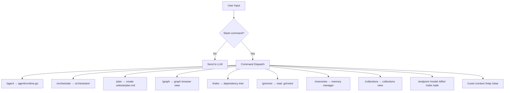
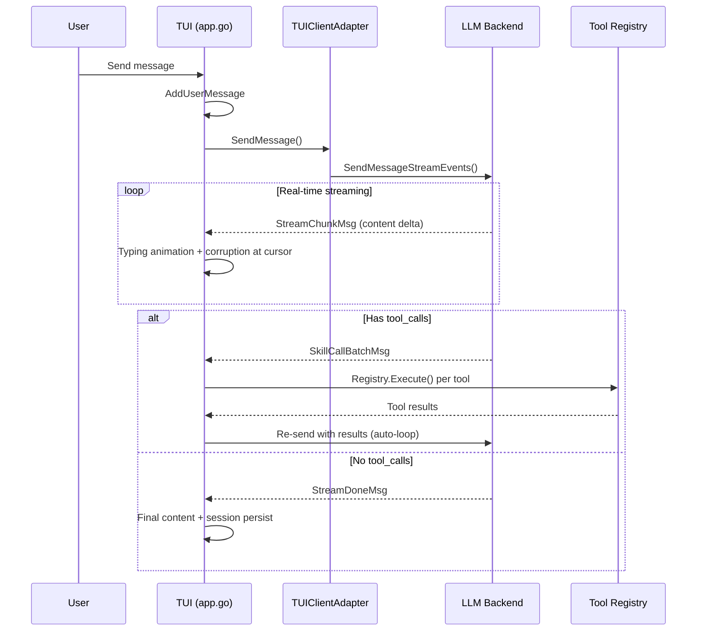
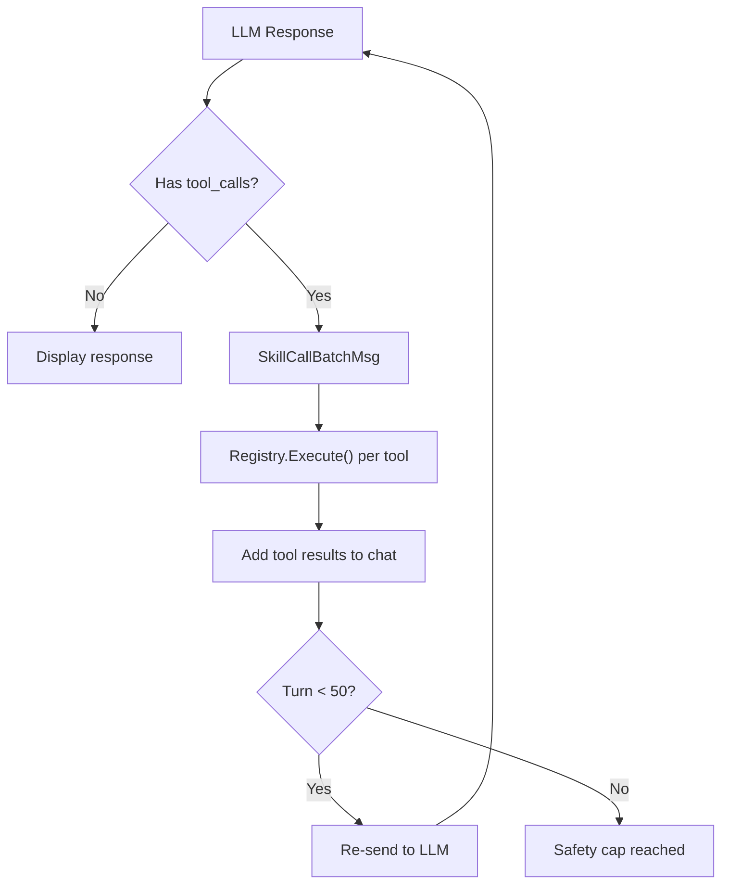
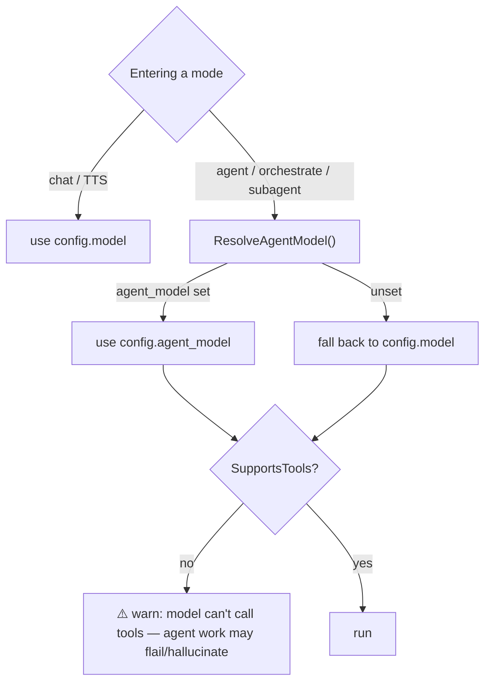
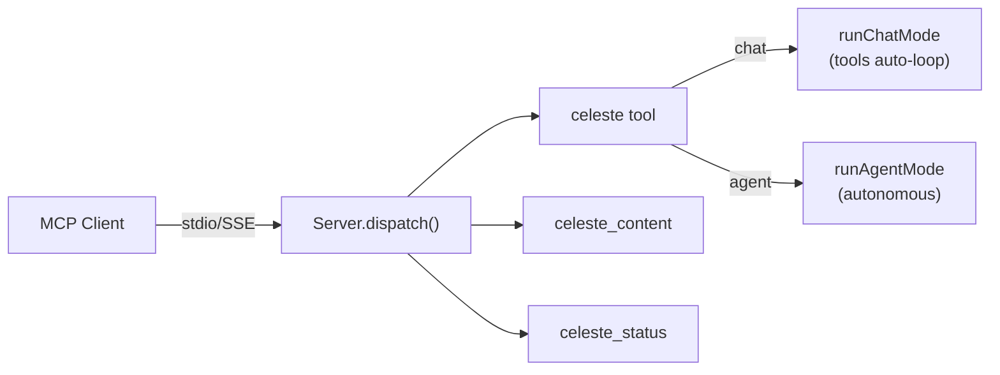

# Command Routing

How user input is routed through the TUI to modes, tools, and LLM providers.

## Slash Commands

All slash commands are parsed in `tui/app.go` and dispatched before reaching the LLM:

## Chat Message Flow

Non-command messages go through the LLM streaming pipeline:

## Tool Execution Loop

Tools auto-loop with a 50-turn safety cap:

## Provider Detection

Provider is auto-detected from the `base_url` in config:

| URL Pattern | Provider | Features |
|---|---|---|
| `api.x.ai` | Grok/xAI | Collections, 2M context |
| `api.openai.com` | OpenAI | Full function calling |
| `api.anthropic.com` | Anthropic | Native SDK, prompt caching |
| `api.venice.ai` | Venice | NSFW, image generation |
| `generativelanguage.googleapis.com` | Gemini | Free tier |
| `openrouter.ai` | OpenRouter | Multi-model |

## Model Routing (chat vs agent model)

Celeste resolves the LLM model per **mode**, because chat and agent work have
different requirements:

| Mode | Model used | Why |
|---|---|---|
| chat, TTS | `config.model` | no tool calling required |
| agent, `/orchestrate`, subagents | `config.ResolveAgentModel()` → `config.agent_model` if set, else `config.model` | **requires function calling** |

- The seam is `agent.Options.Model` (per-run override). The subagent manager
  (`buildAgentOptions`) and MCP `runAgentMode` set it to `ResolveAgentModel()`.
- **Capability guardrail** (`agent/runtime.go`): on runner start, if the resolved
  model fails `providers.NewModelDetection(provider).SupportsTools(model)`, a loud
  warning is printed. This is **provider-agnostic** — it catches Venice
  `venice-uncensored`, tool-less OpenRouter models, older OpenAI/instruct models,
  etc., not just grok.
- **OpenRouter capability is authoritative**: for the OpenRouter provider,
  `SupportsTools` consults the live catalog (`https://openrouter.ai/api/v1/models`,
  per-model `supported_parameters` includes `"tools"`), cached best-effort, falling
  back to a name heuristic if the catalog is unreachable. (A future task adds an
  interactive picker that shows capability + cost from this same catalog.)
- `reconcileModel` applies the same deprecated-model migration (the grok-4-1-*
  trap) to `agent_model` as to `model`.

## MCP Routing

When running as an MCP server (`celeste serve`), requests route through:

Built with [Celeste CLI](https://github.com/whykusanagi/celeste-cli)
